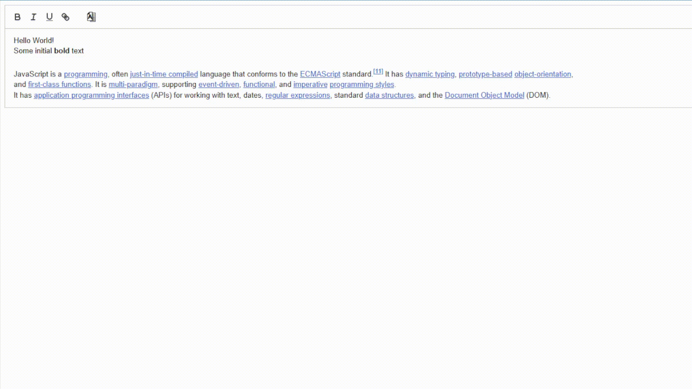

# Quill Synonym Module

A Quill.js module that adds synonym lookup functionality to your editor.

## Installation

```bash
npm install quill-synonym
```

## Usage

To use the module, simply import it into your project and initialize it with the desired options.

```javascript
import Quill from 'quill';
import QuillSynonym from 'quill-synonym';
import 'quill-synonym/dist/synonym.css';

// Register the module
Quill.register('modules/synonym', QuillSynonym);

// Initialize Quill with the synonym module
const quill = new Quill('#editor', {
    modules: {
        toolbar: [
            ['bold', 'italic'],
            ['synonym'] // Add synonym button to the toolbar
        ],
            synonym: {
                container: '#editor'
            }
        },
    theme: 'snow'
});

```

## Demo



See the [demo](https://uluumbch.github.io/quill-synonym/demos/) for live examples.

## Features
- Adds a synonym lookup button to the toolbar
- Uses Datamuse API for synonym suggestions
- Easy word replacement with click selection